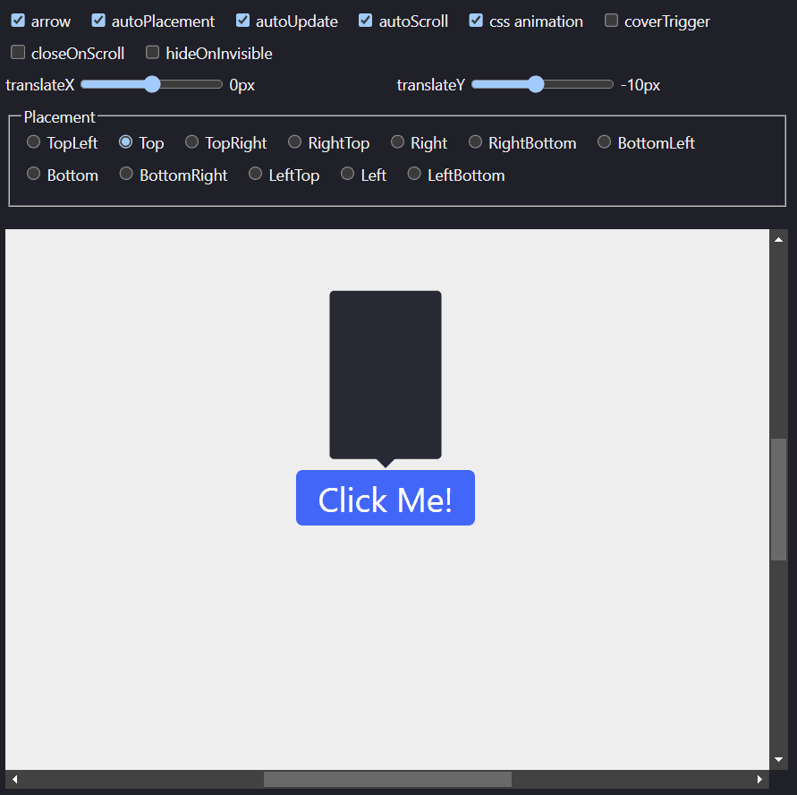

# [Popper](https://nodesignjs.github.io/popper/)

[](https://github.com/nodesignjs/popper) 
[](https://github.com/nodesignjs/popper)

Popper 是一个体积小，功能轻大的弹出工具库，它可以自动定位到 Trigger 附近合适的位置。同时它还支持虚拟元素，可以在 canvas 元素中使用，和 CSS 类动画。

[在线体验](https://nodesignjs.github.io/popper/)

[](https://nodesignjs.github.io/popper/)

[English](./README_zh.md)

## 安装

```
npm i @nodesign/popper
```

或者通过 CDN 使用

```html
<script src="https://unpkg.com/@nodesign/popper@latest/dist/index.min.js"></script>
<script>
  console.log(popper)
</script>
```

## 快速开始

```js
import Popper, { PLACEMENT, EmitType } from '@nodesign/popper'

const container = document.querySelector('.container'); // 默认: document.body
const trigger = document.querySelector('.trigger'); 
// 或者虚拟元素. 类型: { getBoundingClientRect: () =>  { left: number, top: number, width: number, height: number } }

const content = document.createElement('div'); // 你需要弹出显示的内容
content.classList.add('content');

const popper = new Popper({
  container,
  trigger, // 必填
  content, // 必填
  placement: PLACEMENT.T, // 设置弹框位置
  emit: EmitType.HOVER // 设置鼠标 hover 在 trigger 上时打开弹框
})

trigger.onclick = () => {
  popper.toggle()
  // 或者
  // if (popper.opened) {
  //   popper.close();
  // } else {
  //   popper.open();
  // }
}

// 如果你不需要 popper
popper.destroy()
```

### CSS 动画

通过 `cssName` 参数可以在弹出层显示和隐藏时，添加 CSS 动画。

```js
const popper = new Popper({
  cssName: 'fade'
})
```

Popper 会通过 `cssName` 添加下面 6 个类。

```js
`${cssName}-enter-from` // 开始显示，下一帧被移除
`${cssName}-enter-active` // 下一帧被添加，动画结束时移除
`${cssName}-enter-to` // 下一帧被添加，动画结束时移除
`${cssName}-exit-from` // 开始隐藏，下一帧被移除
`${cssName}-exit-active` // 下一帧被添加，动画结束时移除
`${cssName}-exit-to` // 下一帧被添加，动画结束时移除
`${cssName}-${PLACEMENT}` // 当前弹窗位置
```

你可以编写如下 css 样式。

```css
.fade-enter-from, .fade-exit-to {
  transform: scale(.7);
  opacity: 0;
}
.fade-enter-active, .fade-exit-active {
  transition: transform .1s ease, opacity .1s ease;
}
```

### 箭头

通过 `arrow` 参数可以添加自定义箭头元素。

```js
const arrow = document.createElement('div')
arrow.classList.add('arrow')

const popper = new Popper({
  arrow
})
```

```css
.arrow {
  width: 12px;
  height: 12px;
  transform: rotate(45deg);
  transform-origin: center;
  background: #000;
}
```

或者通过内置的 `createArrow` 函数来快速创建 `arrow`。

```ts
import Popper, { createArrow } from '@nodesign/popper' 

const popper = new Popper({
  arrow: createArrow({ background: '#000' })
})
```

### 滚动

通过 `autoScroll` 参数可以控制 `trigger` 元素滚动时，弹出层自动跟随滚动。

`closeOnScroll` 参数控制 `trigger` 元素滚动时，弹出层自动关闭。

`hideOnInvisible` 参数控制 `trigger` 元素在屏幕上看不见时，弹出层自动隐藏。

### 自动更新

`autoUpdate` 参数控制当容器，内容，trigger 大小发生改变时，自动更新弹出层位置。依赖 [ResizeObserver](https://developer.mozilla.org/en-US/docs/Web/API/ResizeObserver) 。

`autoPlacement` 参数控制当空间的不足时是否自动调整位置，让弹出层完全展出出来。

### 钩子

Popper 提供了丰富的钩子函数，可以在弹出层的各个生命周期执行代码。

```js
new Popper({
  onBeforeEnter() {
    // css 展示动画开始前
  },
  onEntered() {
    // css 展示动画完成后
  },
  onBeforeExit() {
    // css 关闭动画开始前
  },
  onExited() {
    // css 关闭动画完成后
  },
  onBeforePosition(pos) {
    // 设置弹出层位置前
    // pos.position 最终的展示位置
    // pos.xy 弹出层的位置，undefined 时表示不展示
    // pos.arrowXY arrow 的位置，undefined 时表示不展示
    // 你可以直接修改 xy 和 arrowXY 来改变最终的位置
    if (pos.xy) pos.xy[0] += 10
    if (pos.arrowXY) pos.arrowXY[0] += 10
  },
  onOpen() {
    // 弹出层展示时
  },
  onClose() {
    // 弹出层关闭时
  }
})
```

### 虚拟元素

`trigger` 参数除了是 DOM 元素之外，还可以是一个虚拟元素。这样你就可以在 canvas 中使用。当 canvas 中发生滚动时，你可以手动调用 `popper.onScroll()` 方法来触发弹出层滚动。

```js
const popper = new Popper({
  trigger: {
    getBoundingClientRect() {
      return {
        left: 0,
        top: 0,
        width: 0,
        height: 0
      }
    }
  }
})

canvas.on('scroll', () => popper.onScroll())
```

## API

### 配置

| 参数 | 类型 | 默认 | 描述 |
| -- | -- | -- | -- |
| `container` | `HTMLElement` | `document.body` | 弹出层的容器 |
| `content` | `Element` | | 必填，要弹出的内容元素 |
| `trigger` | `{ getBoundingClientRect: () => Rect } \| Element` | | 必填，触发元素 |
| `arrow` | `Element` | | 箭头元素 |
| `placement` | `PLACEMENT` | `PLACEMENT.T` | 弹出层的位置 |
| `translate` | `[number, number]` | `[0, 0]` | 自定义 xy 偏移量 |
| `autoPlacement` | `boolean` | `true` | 自动切换位置，当空间不足 |
| `autoUpdate` | `boolean` | `true` | 容器，内容，触发元素大小变化自动更新位置 |
| `autoScroll` | `boolean` | `true` | 自动跟随滚动 |
| `cssName` | `string` | | css 动画类名 |
| `emit` | `EmitType` |  | 触发弹出类型 |
| `clickOutsideClose` | `boolean` | `true` | 点击外部自动关闭弹出 |
| `openDelay` | `number` | | 打开延迟 |
| `closeDelay` | `number` | `50` | 关闭延迟 |
| `open` | `boolean` | | 走来是否默认开启 |
| `disabled` | `boolean` | | 是否禁用 |
| `triggerOpenClass` | `string` | | 弹窗开启时给 `trigger` 添加的 `class` |
| `enterable` | `boolean` | `true` | 当 `emit` 等于 `hover` 时，鼠标是否可进入弹出层 |
| `overflowHidden` | `boolean` | 自动检测 | 容器是否 overflow hidden |
| `coverTrigger` | `boolean` | | 弹出层是否覆盖 trigger 元素 |
| `closeOnScroll` | `boolean` | | 是否在滚动时自动关闭 |
| `hideOnInvisible` | `boolean` | | 让 trigger 元素在屏幕上不可以见时自动隐藏弹出层 |
| `keepDom` | `boolean` | | 保留弹窗元素一直在 DOM 中 | 
| `useTriggerPos` | `boolean` | | 使用 `trigger` 参数返回的 `left` 和 `top` 作为弹框坐标 |
| `closeAni` | `boolean` | `true` | 是否需要关闭动画 |
| `dragEl` | `HTMLElement` | | 用于拖拽弹窗的 DOM 元素 |
| `onBeforeEnter` | `() => void` | | css 进入动画开始之前 |
| `onEntered` | `() => void` | | css 进入动画完成时 |
| `onBeforeExit` | `() => void` | | css 关闭动画开始之前 |
| `onExited` | `() => void` | | css 关闭动画完成 |
| `onBeforePosition` | `(pos: Position) => void` | | 在设置弹出层位置之前，你可以修改 pos 对象，来设置最终弹出层位置 |
| `onOpen` | `() => void` | | 当弹出层展示 |
| `onClose` | `() => void` | | 当弹出层关闭 |
| `onClickOutside` | `() => void` | | 当弹出层关闭 |

### 属性

| 参数 | 类型 | 描述 |
| -- | -- | -- |
| `el` | `HTMLElement` | 弹出层元素 |
| `config` | `PopperConfig` | Popper 配置参数 |
| `opened` | `boolean` | 当前弹出层是否显示 |
| `isAnimating` | `boolean` | 当前是否在进行 css 动画 |

### 方法

#### open()

开启弹出层

```ts
open(): void;
```

#### close()

关闭弹出层

```ts
close(): void;
```

#### toggle()

如果弹出层是关闭的则打开，否则关闭

```ts
toggle(): void;
```

#### openWithDelay()

在 `config.openDelay` 时间之后，打开弹出层

```ts
openWithDelay(): void;
```

#### closeWithDelay()

在 `config.closeDelay` 时间之后，关闭弹出层

```ts
closeWithDelay(): void;
```

#### enable()

启用弹出。

```ts
enable(): void
```

#### disable()

禁用并关闭弹出。

```ts
disable(): void
```

#### updateConfig()

更新参数。

```ts
updateConfig(config: Partial<PopperConfig>): void;
```

#### destroy()

销毁 popper 实例

```ts
destroy(): void;
```

#### onScroll()

手动触发 onScroll 事件，一般只在虚拟元素中使用。

```ts
onScroll(): void;
```

#### update()

手动更新弹出层位置。

```ts
update(): void;
```

### 工具方法

popper 还提供了快速创建 `arrow` 的工具方法。

```ts
import Popper, { createArrow } from '@nodesign/popper'

new Popper({
  arrow: createArrow()
})
```

#### createArrow()

快速创建 `arrow` DOM 元素，可接受 css 样式对象和类名作为参数。

```ts
createArrow(style?: CSSStyleDeclaration, className?: string): HTMLElement;
```
